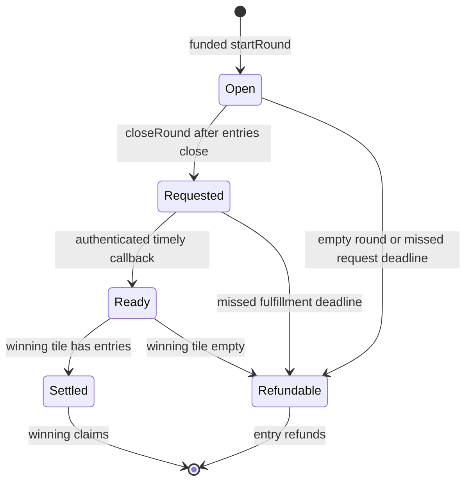

# Contract API

`abi/LaunchToken.json` and `abi/GridMining.json` are compiler-generated ABI arrays. Regenerate with `python3 tools/export_abi.py`; verify with `python3 tools/export_abi.py --check` after `forge build`. No environment variables or network are used. Constructor order and units are in [DEPLOYMENT.md](DEPLOYMENT.md).

## LaunchToken

The standard ERC-20 interface provides `name`, `symbol`, `decimals`, `totalSupply`, `balanceOf`, `allowance`, `approve`, `transfer`, and `transferFrom`, with `Transfer` and `Approval` events and OpenZeppelin ERC-6093 custom errors. Approving `uint256.max` has standard infinite-allowance behavior; applications should normally approve only their intended donation. No administrator ABI is present.

## GridMining mutations

| Method | Caller / value | Result |
| --- | --- | --- |
| `fundRewards(uint256 amount)` | Any Gold holder with allowance, no native value | Irrevocably add Gold to available rewards |
| `startRound()` | Anyone, no native value | Reserve one reward, return the next round ID |
| `enter(uint256 roundId, uint32 tiles)` | Player, exact native entry payment | Add tickets for the selected previously unused tiles |
| `closeRound(uint256 roundId)` | Anyone after entry close | Request VRF, or recycle the reward for an empty round |
| `rawFulfillRandomWords(uint256 requestId, uint256[] words)` | Immutable coordinator only | Store a timely valid single-word callback |
| `settleRound(uint256 roundId)` | Anyone after a valid callback | Finalize winner count or empty-tile refunds |
| `expireRound(uint256 roundId)` | Anyone after a missed deadline | Make the whole round refundable |
| `claim(uint256 roundId, address recipient)` | Eligible player, no native value | Atomically transfer native currency and Gold, or a native refund |

The only payable function is `enter`. There is no fallback/receive entry point. Claiming on someone else's behalf is unsupported; `recipient` redirects only the caller's own entitlement and cannot be zero or the game itself. There are no player-enumeration or unbounded batch functions; index events off chain.

## Reads and lifecycle

`currentRound()` is zero before the first round. Round IDs start at one. `getRound(id)` returns:

| Field | Meaning |
| --- | --- |
| `state` | 0 None, 1 Open, 2 Requested, 3 Ready, 4 Settled, 5 Refundable |
| `winningTile` | Zero-based winning tile after settlement; zero before settlement is not a result |
| `closesAt` | Exclusive timestamp bound for entry |
| `deadline` | Request deadline while Open; fulfillment deadline while Requested; irrelevant after Ready |
| `requestId` | Accepted oracle request ID, zero before a request |
| `randomWord` | Fulfilled word; zero is valid, so inspect state |
| `entries` | Total purchased tile tickets |
| `pot` | Original native-currency entry pot |
| `winners` | Tickets on the selected tile, populated on settlement |
| `claimedWinners` | Number of successful winning claims |
| `remainingNative` | Remaining native claims/refunds for this round |
| `remainingGold` | Reserved Gold still owed; zero for refundable rounds |

Round storage remains queryable after all claims. `Settled` and `Refundable` are final states; a new round does not wait for withdrawals. Open rounds can already be past `closesAt`, so the frontend must check both state and time.

Other reads: immutable configuration getters; `availableRewards`, `reservedRewards`, `nativeLiability`; `selections(roundId, player)` (bitmap), `tileEntries(roundId, tile)` (ticket count), `claimed(roundId, player)`, `requestRound(requestId)` (binding), and `claimable(roundId, player)` (current native/Gold entitlement). Unknown IDs and ineligible or already claimed accounts return zero entitlement. `TILE_COUNT` is 25 and `ALL_TILES` is 33554431.

## Events and failure behavior

Index `RoundOpened`, `Entered`, `RandomnessRequested`, `RandomnessReceived`, `RoundSettled`, `RoundRefundable`, `Claimed`, and `RewardsFunded`. `CallbackIgnored` records an authenticated but stale, unknown, malformed or expired callback; it does not mean settlement succeeded. `RoundRefundable.reason` is 0 EmptyRound, 1 EmptyTile, or 2 Timeout. The ABI includes exact indexed fields and types.

Core validation errors are `InvalidConfiguration`, `InvalidAmount`, `WrongState`, `TooEarly`, `DeadlinePassed`, `InvalidTiles`, `DuplicateTile`, `IncorrectPayment`, `InsufficientRewards`, `UnauthorizedCoordinator`, `InvalidRequestId`, `NothingToClaim`, `InvalidRecipient`, and `TransferFailed`. The inherited reentrancy guard exposes `ReentrancyGuardReentrantCall`. ERC-20 and coordinator reverts propagate. A failed transaction preserves balances, reserves, claims and state atomically. Authorized ignored callbacks return successfully to avoid disrupting the oracle transaction.
